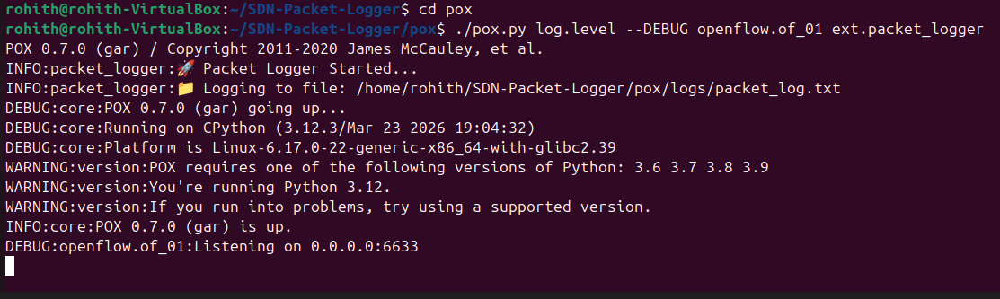
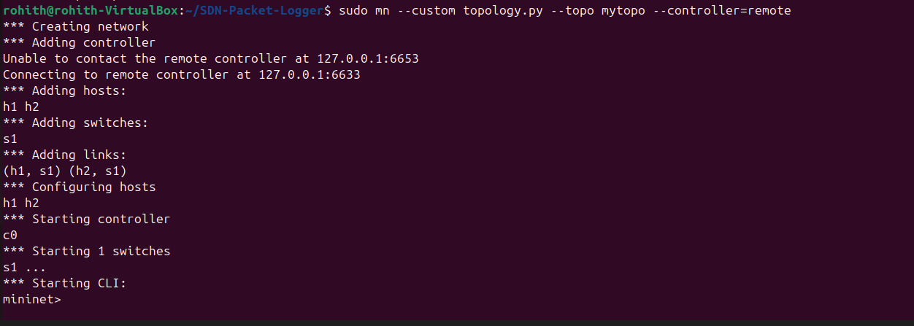
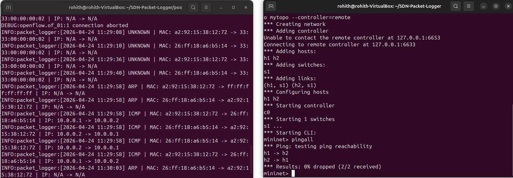
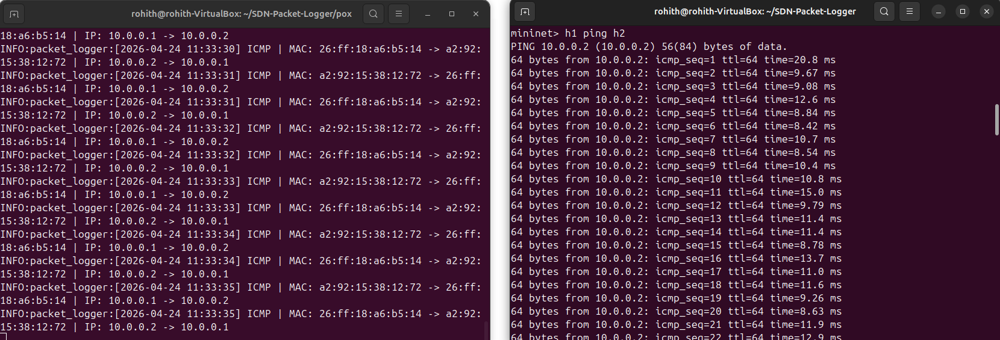
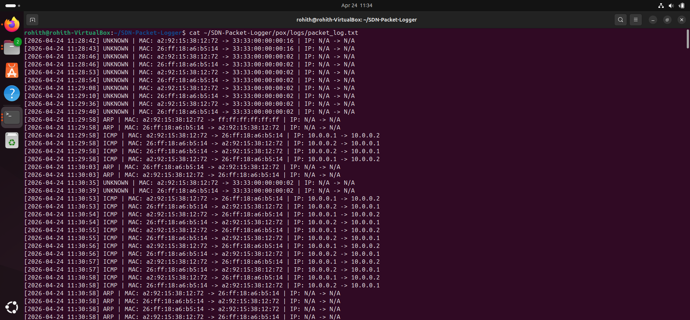

# 📡 SDN Packet Logger using POX Controller

## 📌 Project Overview

This project implements a **Packet Logging Application** using a **Software Defined Networking (SDN)** architecture with the POX controller.

The application captures packets traversing a virtual network, analyzes them to determine protocol types, and logs relevant information such as:

- Source & Destination MAC addresses  
- Source & Destination IP addresses  
- Protocol type (ARP, ICMP, TCP, UDP)  
- Timestamp of each packet  

---

## 🎯 Objectives

- Capture packets using controller events (**PacketIn**)  
- Identify protocol types (ARP, ICMP, TCP, UDP)  
- Log packet details in real-time  
- Store logs in a file for analysis  
- Display packet information on the controller  

---

## 🏗️ System Architecture

- **Controller**: POX (OpenFlow 1.0)  
- **Network Emulator**: Mininet  
- **Switch**: Open vSwitch (OVS)  
- **Topology**: Custom topology using `topology.py`  

---

## 📂 Project Structure

```
SDN-Packet-Logger/
│
├── controller/
│   └── packet_logger.py       # Main POX controller application
│
├── topology.py                # Mininet topology
│
├── logs/
│   └── packet_log.txt         # Generated log file
│
├── Screenshots/               # Demo screenshots
│   ├── Screenshots-1(controller_running)
│   ├── Screenshots-2(mininet_topology)
│   ├── Screenshots-3(pingall)
│   ├── Screenshots-4,5(ping and controller_logs)
│   ├── Screenshots-6(log_file)
│
└── README.md
```

---

## ⚙️ How It Works

1. Mininet generates network traffic between hosts  
2. Switch sends packets to controller via **PacketIn events**  
3. POX controller:
   - Extracts packet headers  
   - Identifies protocol type  
   - Logs packet details  
4. Packets are forwarded using **OpenFlow rules (FLOOD)**  

---
---

## ▶️ How to Run

📌 **Important:**  
📌 Follow the complete setup and execution steps here:  
➡️ [run-guide.md](run-guide.md)

This file contains step-by-step commands, terminal usage, and required screenshots for proper demonstration.

---
## ▶️ Execution Steps

### 1. Start POX Controller
```bash
cd pox
./pox.py log.level --DEBUG openflow.of_01 ext.packet_logger
```

📸 *Screenshot:*  


---

### 2. Start Mininet
```bash
sudo mn -c
sudo mn --custom topology.py --topo mytopo --controller=remote --switch ovsk,protocols=OpenFlow10
```

📸 *Screenshot:*  


---

### 3. Test Connectivity
```bash
pingall
```

📸 *Screenshot:*  


---

### 4. Generate Traffic
```bash
h1 ping h2
```


---

### 5. View Controller Logs

Example output:
```
ICMP | MAC: 10.0.0.1 -> 10.0.0.2
```

📸 *Screenshot:*  


---

### 6. View Log File
```bash
cat logs/packet_log.txt
```

📸 *Screenshot:*  


---

### 7. View Flow Table (Optional)
```bash
sh ovs-ofctl dump-flows s1
```


## 📊 Sample Output

```
[2026-04-24 08:08:35] ICMP | MAC: 66:2d:b5:cb:19:54 -> ea:8b:aa:7e:d7:0c | IP: 10.0.0.2 -> 10.0.0.1
```

---

## ⚠️ Note on Flow Table Output

This project uses **reactive forwarding with flooding (OFPP_FLOOD)**.

- Flow entries may not persist in the switch  
- Flow table may appear empty  
- This is expected behavior  

✔ Verification should be done using:
- Successful `pingall`
- Controller logs
- Log file output  

---

## 🎤 Demo Explanation

> The POX controller captures PacketIn events, extracts MAC and IP headers, identifies protocol types, logs packet information, and forwards packets using OpenFlow flooding.

---

## 📸 Screenshots Reference

| Step | Description | Screenshot |
|------|------------|-----------|
| 1 | Controller running | Screenshots/Screenshot-1.png |
| 2 | Mininet topology | Screenshots/Screenshot-2.png |
| 3 | pingall result |Screenshots/Screenshot-3.png |
| 4 | Ping traffic and Controller logs | Screenshots/Screenshot-4,5.png |
| 5 | Log file | Screenshots/Screenshot-6.png |


---

## 🚀 Features

- Real-time packet capture  
- Protocol identification  
- File-based logging  
- SDN-based centralized control  
- Easy to extend for advanced analytics  

---

## 🧠 Future Enhancements

- Learning switch (MAC-based forwarding)  
- Protocol statistics dashboard  
- Web-based monitoring UI  
- Packet filtering and anomaly detection  

---

## 👨‍💻 Author

**Rohith G S**  
GitHub: https://github.com/Rohith-S636

---

## ⭐ Conclusion

This project demonstrates how SDN controllers can be used to monitor and analyze network traffic dynamically, providing flexibility and centralized control over the network.

---
